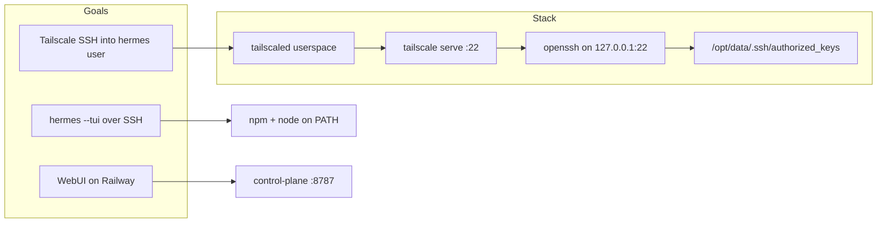

# Park: Tailscale SSH + TUI/npm initiative

## Current production state

| Item | Status |
|------|--------|
| **Stay on** | **v0.3.7** — SSH works |
| **Avoid** | **v0.3.8** — SSH hangs again (revert confirmed) |
| **Shipped on main** | #15 (0.3.5–0.3.7): openssh default, `TAILSCALE_SSH_AUTHORIZED_KEYS` |
| **Shipped on main** | #16 (0.3.8): TUI/npm/PATH fixes — **regressed SSH** |
| **In workspace, uncommitted** | 0.3.9 fix (split cont-init, revert risky `05` changes) |

## Initiative scope (what we were solving)



1. **Tailscale SSH on Railway** (userspace, no TUN): `tailscale ssh` / OpenSSH over tailnet
2. **`hermes --tui`** over SSH: Node/npm discovery in Python CLI
3. **Operational hygiene**: correct repo remotes (`tyrliang`, not `sphinxcode`)

---

## What shipped (0.3.5 → 0.3.7)

Key files (unchanged in 0.3.8):

- [`docker/s6-rc.d/tailscaled/run`](docker/s6-rc.d/tailscaled/run) — `TAILSCALE_SSH=openssh` default: `sshd` on loopback + `tailscale serve --tcp 22`
- [`docker/cont-init.d/06-tailscale-ssh-dir`](docker/cont-init.d/06-tailscale-ssh-dir) — merges `TAILSCALE_SSH_AUTHORIZED_KEYS` into `/opt/data/.ssh/authorized_keys`
- [`docker/sshd/hermes-tailscale.conf`](docker/sshd/hermes-tailscale.conf) — `ListenAddress 127.0.0.1`, `AuthorizedKeysFile /opt/data/.ssh/authorized_keys`

**Why Tailscale SSH mode (`--ssh`) was abandoned:** TCP :22 connects but clients hang after `Local version string` (no remote banner); control plane showed `NO_SSH_HOST_KEY` on userspace Railway.

---

## TUI/npm problem (motivation for 0.3.8)

**Symptom:** `which npm` works in zsh; `hermes --tui` prints `npm not found`.

**Root causes found:**

1. **`load_hermes_dotenv(override=True)`** in [`vendor/hermes-agent/hermes_cli/main.py`](vendor/hermes-agent/hermes_cli/main.py) — a `PATH=` line in `/opt/data/.hermes/.env` overrides shell PATH and hides `/usr/local/bin`
2. **0.3.7 image never applied CLI patches** — cont-init only; running code at `/opt/hermes/hermes_cli/main.py` had **0** `HERMES_NPM` references
3. **Python vs shell** — `shutil.which` / `os.access(X_OK)` stricter than zsh `which` for `npm` symlink → `.js`

**0.3.8 fix intent:**

- `COPY vendor/.../main.py` into image
- `_ensure_container_node_path_after_dotenv()` after dotenv load
- `_resolve_tool_bin()` + `HERMES_NPM`
- Expanded [`docker/cont-init.d/05-hermes-path`](docker/cont-init.d/05-hermes-path): npm wrappers, `chown -R`, `HERMES_NPM` in s6 env

---

## 0.3.8 SSH regression (why it broke)

**Critical finding:** 0.3.8 diff does **not** touch Tailscale/SSH scripts. Regression is **indirect** via cont-init.

| 0.3.7 `05-hermes-path` | 0.3.8 `05-hermes-path` |
|------------------------|------------------------|
| PATH + `HERMES_NODE` only | + mkdir/ln/cat wrappers on volume |
| Runs before `06` | Same order — **blocks SSH setup if it fails** |
| No chown on volume | `chown -R hermes:hermes /opt/data/.local/bin` every boot |

**Likely failure modes:**

1. **`set -eu` exit** — `ln`/`cat` fails on messy `/opt/data/.local/bin` (root-owned `npm`, permission denied seen in debugging) → cont-init fails → **`06-tailscale-ssh-dir` may not run**
2. **`chown -R`** on a large persisted `.local/bin` → slow cont-init → tailscaled/sshd start late → looks like “hang”
3. **Secondary:** unpinned `HERMES_IMAGE=nousresearch/hermes-agent:latest` — 0.3.7 vs 0.3.8 builds may differ in base layer (not in git diff but correlates with redeploy)

**Boot order (alphabetical cont-init):**

```
03-all-in-one-setup → 04-tailscale-env → 05-hermes-path → 06-tailscale-ssh-dir
```

SSH keys and `.ssh` perms are **`06`** — must never depend on npm/TUI work in **`05`**.

---

## Proposed fix (0.3.9) — drafted locally, not committed

When you unpark, implement/ship this split (already in working tree):

| Script | Role |
|--------|------|
| [`05-hermes-path`](docker/cont-init.d/05-hermes-path) | Revert to 0.3.7-style PATH + `HERMES_NODE` only |
| **New** [`07-hermes-npm-wrappers`](docker/cont-init.d/07-hermes-npm-wrappers) | npm/npx wrappers, narrow `chown` on created files only, `HERMES_NPM` after wrappers exist |
| [`Dockerfile`](Dockerfile) | Keep `COPY main.py`; remove `HERMES_NPM` from `ENV` (set at boot); `chmod +x` for `07` |
| [`VERSION`](VERSION) | Bump to `0.3.9` |

**Keep from 0.3.8 (safe for TUI):**

- `COPY vendor/hermes-agent/hermes_cli/main.py` — dotenv PATH guard + `_resolve_tool_bin`
- Do **not** put npm wrapper logic back into `05`

**Optional hardening (future):**

- Pin `HERMES_IMAGE` by digest in Dockerfile (stop `latest` drift between releases)
- README note: do not set `PATH=` in `/opt/data/.hermes/.env` without `/usr/local/bin`

---

## Document to create (park deliverable)

Create **`docs/parked-tailscale-ssh-and-tui.md`** containing:

- This summary (production state, version matrix, root causes)
- PR history: tyrliang #15, #16; wrong-repo sphinxcode PRs closed
- Git remote hygiene: `origin` = tyrliang, `upstream` (sphinxcode) removed, `gh repo set-default tyrliang/hermes-all-in-one`
- Diagnostic commands for next debug session
- Resume checklist (below)

No code merge required to park — doc only unless you also want the 0.3.9 commit in the same PR.

---

## Resume checklist (when you return)

1. **Verify logs on broken 0.3.8** (if still available):
   ```bash
   grep -E '05-hermes-path|06-tailscale|exited [^0]|\[tailscaled\]|openssh|sshd'
   ```
2. **Commit + PR 0.3.9** on `tyrliang/hermes-all-in-one` (`gh pr create --repo tyrliang/hermes-all-in-one`)
3. **Deploy v0.3.9** on Railway (same volume)
4. **SSH test:** `tailscale ssh hermes@<node>` — expect banner, not hang
5. **TUI test:** `hermes --tui` — expect Ink TUI or clear error (WebUI still preferred on Railway)
6. **Boot log:** `npm=yes (/opt/data/.local/bin/npm)` from `07-hermes-npm-wrappers`
7. **Volume sanity:** `ls -la /opt/data/.local/bin /opt/data/.ssh`; `grep '^PATH=' /opt/data/.hermes/.env`

---

## Related files quick index

- SSH: [`docker/s6-rc.d/tailscaled/run`](docker/s6-rc.d/tailscaled/run), [`06-tailscale-ssh-dir`](docker/cont-init.d/06-tailscale-ssh-dir), [`docker/sshd/hermes-tailscale.conf`](docker/sshd/hermes-tailscale.conf)
- TUI/PATH: [`vendor/hermes-agent/hermes_cli/main.py`](vendor/hermes-agent/hermes_cli/main.py), [`05-hermes-path`](docker/cont-init.d/05-hermes-path), [`07-hermes-npm-wrappers`](docker/cont-init.d/07-hermes-npm-wrappers)
- Env: [`.env.example`](.env.example) — `TAILSCALE_SSH`, `TAILSCALE_SSH_AUTHORIZED_KEYS`
- User docs: [`README.md`](README.md) § Tailscale shell access, § TUI over SSH
