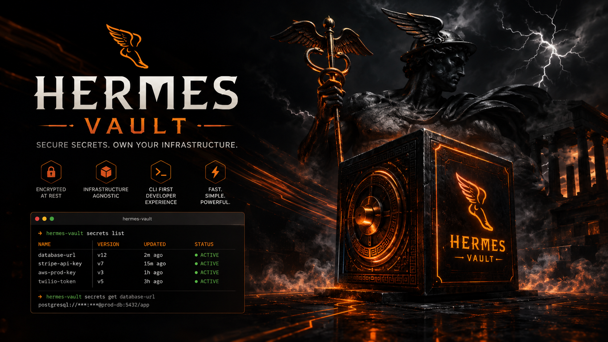
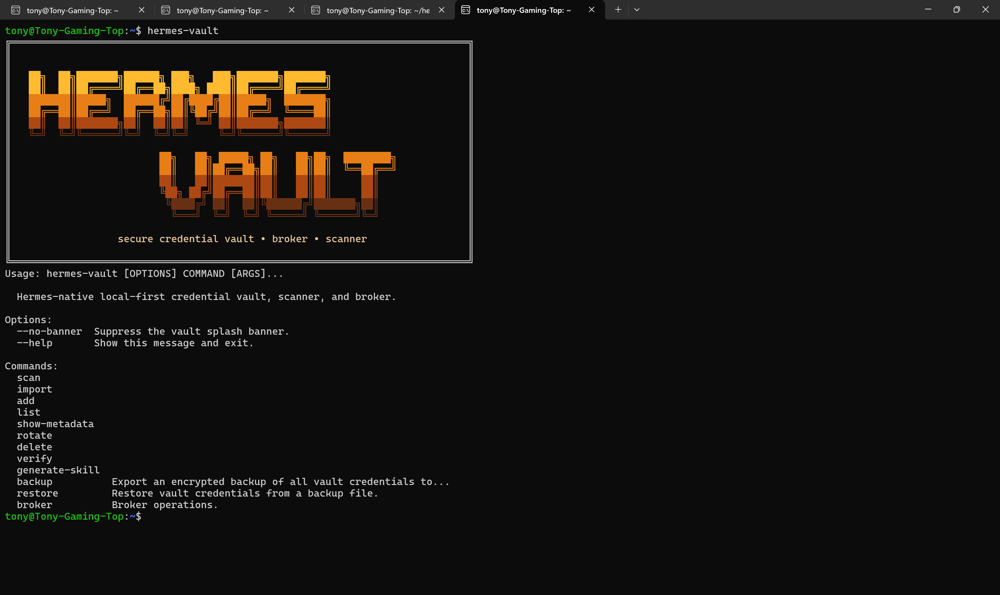
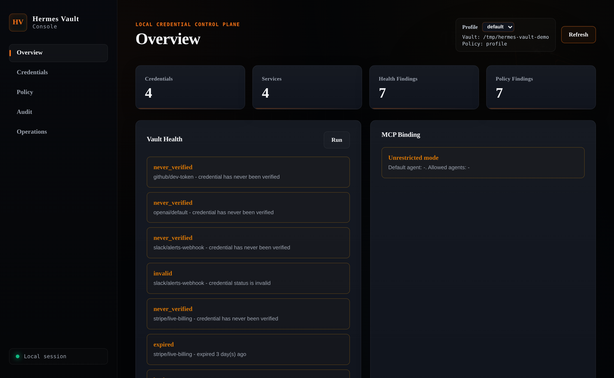

# Hermes Vault



Hermes Vault is a local-first credential broker and encrypted vault for Hermes agents. It scans for risky plaintext secrets, stores credentials locally, verifies them before re-auth claims, and turns agent access into explainable, lease-aware operator workflows.

v0.21.0 is the **Audit Assurance** release. Hermes Vault now provides signed, verifiable audit continuity with authenticated checkpoints, backup integrity, and read-only verification through CLI, dashboard, and MCP surfaces.

## What's New in 0.21.0

v0.21.0 adds cryptographic audit integrity assurance to Hermes Vault's existing protection surface.

- Every audit append generates a signed, chain-authenticated integrity record using HKDF-derived Ed25519 signatures.
- An authenticated checkpoint outside the audit table protects the verification boundary.
- Legacy v0.20 audit history is preserved and anchored without destructive migration.
- `hvbackup-v2` backup format includes audit integrity evidence, segments, and verification summary.
- Transactional restore stages database and checkpoint changes atomically.
- `hermes-vault audit-verify`, `audit-checkpoint`, and `audit-export --with-integrity` provide operator visibility.
- The dashboard exposes read-only integrity status via `GET /api/audit-integrity`.
- MCP exposes metadata-only integrity status through `vault://audit-integrity` and a summary in `vault://status`.
- Backward-compatible with v0.20 vaults, policies, and cloud provider configs.

## What It Does

- Scans Hermes-relevant files for plaintext secrets, duplicates, and insecure permissions
- Encrypts credentials in a local SQLite-backed vault
- Brokers access with per-agent policy and ephemeral environment materialization
- Verifies credentials before any re-auth recommendation
- Refreshes already-authorized OAuth credentials without opening a browser when a refresh token exists
- Generates `SKILL.md` files for Hermes agents and sub-agents
- Provides a token-guarded local dashboard for operator visibility and safe actions

### CLI snapshot

The original terminal-first banner still reflects the operator workflow that powers the project:



## Install

Released CLI installs are safest with an isolated tool manager:

```bash
uv tool install git+https://github.com/asimons81/hermes-vault.git@vX.Y.Z
pipx install git+https://github.com/asimons81/hermes-vault.git@vX.Y.Z
```

### Windows

Hermes Vault runs natively on Windows -- no WSL required.

```powershell
# Install with uv (recommended)
uv tool install git+https://github.com/asimons81/hermes-vault.git@v0.20.0

# Or with pipx
pipx install git+https://github.com/asimons81/hermes-vault.git@v0.20.0

# Or with pip (editable dev install)
python -m venv .venv
.venv\Scripts\activate
python -m pip install -e '.[dev]'
```

#### DPAPI master-key protection

On Windows, Hermes Vault can wrap the derived master key with the OS-level Data Protection API so the on-disk form is bound to your user account. Install `pywin32` (`uv pip install 'hermes-vault[windows]'`) and opt in with `$env:HERMES_VAULT_DPAPI = "1"`. The passphrase is still required. DPAPI protects the salt file at rest, not the in-memory key.

Default vault location: `%LOCALAPPDATA%\HermesVault`

All CLI commands work from PowerShell. See [docs/windows.md](docs/windows.md)
for the full Windows guide, including Task Scheduler setup, PowerShell examples,
and known limitations.


For local development, use `uv` or editable `pip`:

```bash
uv sync --extra dev
```

Or with pip:

```bash
python3 -m pip install -e .[dev]
```

Hermes Vault targets Python 3.11+.

## For Contributors

Start with [CONTRIBUTING.md](CONTRIBUTING.md) for local setup, safe test vault usage, test commands, and PR expectations.

Quick contributor loop:

```bash
uv sync --extra dev
uv run python -m pytest tests/ -q
```

Or with an editable pip install:

```bash
python3 -m venv .venv
source .venv/bin/activate
python -m pip install -e '.[dev]'
python -m pytest tests/ -q
```

Helpful docs:

- [Contributor architecture map](docs/contributor-architecture.md)
- [Detailed architecture notes](docs/architecture.md)
- [Operator guide](docs/operator-guide.md)
- [MCP server guide](docs/mcp-server.md)
- [Threat model](docs/threat-model.md)
- [Credential lifecycle](docs/credential-lifecycle.md)

For issues and PRs, use the GitHub templates. Never paste real tokens, passphrases, vault databases, provider token responses, or unredacted `.env` files into issues, docs, tests, logs, or screenshots.

## Update

Check for the latest tagged release without changing the environment:

```bash
hermes-vault update --check
```

Apply a guarded update:

```bash
hermes-vault update
```

`hermes-vault update` currently auto-updates only for `pipx` and `uv tool` installs. Editable/dev installs, generic `pip` installs, and unknown environments receive an explicit manual command instead of an automatic mutation.

## Quick Start

```bash
export HERMES_VAULT_HOME=~/.hermes/hermes-vault-data
export HERMES_VAULT_PASSPHRASE='choose-a-strong-local-passphrase'
hermes-vault --help
hermes-vault bootstrap --from-env ~/.hermes/.env --agent hermes --dry-run
hermes-vault bootstrap --from-env ~/.hermes/.env --agent hermes
hermes-vault verify --all
hermes-vault policy doctor
hermes-vault policy explain hermes openai --action get_env
hermes-vault policy pack list
hermes-vault request access openai --agent hermes --purpose "demo task" --ttl 600
hermes-vault lease checkout openai --agent hermes --purpose "demo task" --ttl 600
hermes-vault generate-skill --all-agents
hermes-vault dashboard --no-open
```

Default runtime state lives in `~/.hermes/hermes-vault-data`. The first `list`, `scan`, import, or bootstrap command initializes the runtime layout and default policy if they don't exist yet. Preview imports and recovery operations before mutating the vault.

## First Safe Agent Bootstrap

Use the guided path from `.env` to safe agent access:

```bash
hermes-vault bootstrap --from-env .env --agent hermes --dry-run --json
hermes-vault bootstrap --from-env .env --agent hermes
```

The bootstrap report is deliberately redacted. It shows importable env names, skipped env names, policy-doctor summary, generated skill contract path, broker-env next command, and an MCP config snippet. It never prints secret values. `--dry-run` does not mutate the vault or the source `.env` file. Non-dry-run imports mapped credentials into the encrypted local vault, and `--redact-source` comments out only lines that were successfully imported.

Use repeatable `--map ENV_NAME=service:credential_type` when an env name is intentionally non-standard:

```bash
hermes-vault bootstrap --from-env .env --agent coder --map CUSTOM_VENDOR_TOKEN=custom-vendor:api_key
```

For browserless first login, use either explicit device login or the unified headless shortcut:

```bash
hermes-vault oauth device-login google --alias work
hermes-vault oauth login google --alias work --headless
```

Providers without device-code support fail closed and tell you to use the browser callback path with `--no-browser` instead.

## Importing `.env` Files

Preview first:

```bash
hermes-vault import --from-env .env --dry-run
```

The env importer reports both importable names and skipped names. Known hints and safe suffixes are imported automatically: `*_API_KEY`, `*_TOKEN`, `*_AUTH_TOKEN`, and `*_ACCESS_TOKEN`. Public config such as `NEXT_PUBLIC_*`, broad DB URLs, passwords, JWT/session/app secrets, and unknown names stay skipped unless you explicitly map them.

Use repeatable `--map` overrides when a skipped key is intentional:

```bash
hermes-vault import --from-env .env --map CUSTOM_VENDOR_TOKEN=custom-vendor:personal_access_token
hermes-vault import --from-env .env --map DATABASE_URL=postgres:connection_url
```

When `--redact-source` is used, only successfully imported env lines are commented out. Skipped lines remain unchanged and are counted in the summary. `--dry-run --redact-source` never changes the source file.

## Hermes Vault Console

Hermes Vault Console, introduced in v0.8.0 and expanded through v0.20.0, is the local dashboard for the credential broker. It gives operators one browser view of vault health, credential metadata, policy drift, audit activity, MCP binding, agent context, access requests, recovery posture, and safe operations without turning the browser into a secret viewer.

Launch it from the same machine that owns the vault:

```bash
hermes-vault dashboard
hermes-vault dashboard --no-open
hermes-vault dashboard --port 8765
hermes-vault dashboard --ttl-seconds 3600
```

Use `--no-open` for headless or remote terminal sessions, then open the printed URL from a local browser that can reach `127.0.0.1` on that machine.

The console runs locally on `127.0.0.1` with token-guarded access. The launch command prints a process-local tokenized URL, and API calls need that token until the TTL expires or the process stops. The browser UI is served from packaged static assets under `hermes_vault/dashboard_static/`; packaged installs need those assets present in the wheel or source distribution. API responses redact raw secret and token material, so browser clients receive metadata and bounded action results rather than credential payloads. Keep treating the browser session as local operator access, not as a remote admin surface.

Dashboard views include Health, Credential Inventory, Policy Findings, Command Center, Lease Inventory, Audit Activity, and Operations Panel. Together they answer the questions an agent operator needs before handing credentials to autonomous systems: is the vault healthy, what can this agent do, why would access be allowed or denied, which requests need approval, are leases bounded, can backups be drilled, and what would maintenance do next?

Dashboard actions stay inside a conservative safety boundary. The console can run health checks, policy doctor, credential verification, OAuth refresh dry-run, maintenance dry-run, backup verification, restore dry-runs, policy explain, agent context, access request creation, request approval/denial, and recovery drills. Live token refresh, live maintenance mutation, credential editing, policy editing, destructive restore, cloud sync, raw encrypted payload display, and remote binding stay out of the console.



Screenshot set captured with a temporary demo vault and fake/demo credentials only:

- [Health view](docs/assets/v0.8.0-dashboard/dashboard-health.png)
- [Credential Inventory view](docs/assets/v0.8.0-dashboard/dashboard-credential-inventory.png)
- [Audit Activity view](docs/assets/v0.8.0-dashboard/dashboard-audit-activity.png)
- [MCP Binding Status view](docs/assets/v0.8.0-dashboard/dashboard-mcp-status.png)
- [Recovery Posture view](docs/assets/v0.8.0-dashboard/dashboard-recovery-posture.png)
- [Operations Panel view](docs/assets/v0.8.0-dashboard/dashboard-operations.png)

The screenshots and launch notes above are the legacy v0.8.0 baseline. They still document the local-only, token-guarded safety boundary, but the dashboard has grown since then and the v0.20.0 launch visuals need a fresh screenshot set before publishing updated images.

## MCP Server

Hermes Vault exposes the broker as an MCP (Model Context Protocol) server so that compatible hosts can request credentials programmatically.

```bash
hermes-vault mcp
```

Configure your MCP host (Claude Desktop, Cursor, etc.) to run:

```json
{
  "mcpServers": {
    "hermes-vault": {
      "command": "hermes-vault",
      "args": ["mcp"],
      "env": {
        "HERMES_VAULT_PASSPHRASE": "your-passphrase"
      }
    }
  }
}
```

If the MCP server is started without an allowed-agent binding, every tool call still requires a caller-supplied `agent_id`. When the server is launched with both `HERMES_VAULT_MCP_ALLOWED_AGENTS` and `HERMES_VAULT_MCP_DEFAULT_AGENT`, the host may omit `agent_id` and the server uses the configured default agent within that allowed set.

Example bound launch:

```bash
export HERMES_VAULT_MCP_ALLOWED_AGENTS='hermes,claude-desktop'
export HERMES_VAULT_MCP_DEFAULT_AGENT='claude-desktop'
hermes-vault mcp
```

The same `policy.yaml` that gates CLI access also gates MCP access. The bound-agent env vars are a deployment guardrail, not a replacement for policy.

### MCP Tools

| Tool | Description | Policy Gate |
|---|---|---|
| `list_services` | List credentials visible to the agent | `capability:list_credentials` |
| `get_credential_metadata` | Fetch credential metadata (no secrets) | `can_read(service)` |
| `get_ephemeral_env` | Materialise ephemeral env vars | `can_env(service)` |
| `verify_credential` | Verify a credential against its provider | `can_verify(service)` |
| `rotate_credential` | Rotate a credential to a new secret | `can_rotate(service)` |
| `scan_for_secrets` | Scan filesystem for plaintext secrets | `capability:scan_secrets` |
| `oauth_login` | Initiate PKCE OAuth login (returns auth URL) | `capability:add_credential` |
| `oauth_device_login` | Initiate device-code OAuth login for supported providers | `capability:add_credential` |
| `oauth_provider_status` | Report OAuth provider readiness and safe next commands | MCP binding only |
| `oauth_refresh` | Refresh an OAuth access token using stored refresh token | `action:rotate` |

MCP access is brokered through policy-gated tools. Prefer `get_ephemeral_env` for TTL-bounded environment materialization instead of direct raw-secret handling.

## Hermes Secret Source Plugin

Hermes Vault also ships a standalone Hermes Secret Source plugin under
`plugins/hermes-vault-secret-source/`. Use it when Hermes should materialize
explicit provider env vars at process startup. MCP remains the in-loop control
plane for agent actions, while Secret Source is only for bootstrap credentials:

```yaml
secrets:
  sources: [hermes_vault]
  hermes_vault:
    enabled: true
    binary: hermes-vault
    agent: hermes
    ttl_seconds: 900
    timeout_seconds: 30
    home: ~/.hermes/hermes-vault-data
    policy: ~/.hermes/hermes-vault-data/policy.yaml
    env:
      OPENAI_API_KEY: hv://openai
      GITHUB_TOKEN: hv://github?alias=work
```

Keep `HERMES_VAULT_PASSPHRASE` available to the Hermes process as a bootstrap
secret. The plugin is v1 mapped-only: no bulk export, no refresh, no write-back,
and no mid-session secret API. The first Hermes process that installs or
surfaces the plugin may not use it until the next Hermes process starts because
plugin discovery happens after startup env loading. See
[docs/hermes-secret-source-plugin.md](docs/hermes-secret-source-plugin.md).

### OAuth via MCP

Hermes Vault can broker OAuth logins so agents avoid raw-password handling. `oauth_login` returns an authorization URL and spins up a local callback server, while `oauth_device_login` starts device-code login for providers that support it. `oauth_provider_status` reports provider readiness, missing env vars, and safe next commands without returning token material. `oauth_refresh` renews existing OAuth tokens proactively before expiry. See [docs/mcp-server.md](docs/mcp-server.md) for full tool schemas.

## Common Commands

```bash
hermes-vault scan
hermes-vault update --check
hermes-vault import --from-env ~/.hermes/.env --dry-run
hermes-vault import --from-env ~/.hermes/.env
hermes-vault import --from-env ~/.hermes/.env --map CUSTOM_VENDOR_TOKEN=custom-vendor:personal_access_token
hermes-vault add openai --alias primary
hermes-vault list
hermes-vault verify openai
hermes-vault broker env openai --agent dwight --ttl 900
hermes-vault audit --agent dwight --since 7d
hermes-vault status
hermes-vault status --stale 7d
hermes-vault status --invalid
hermes-vault set-expiry openai --alias primary --days 90
hermes-vault clear-expiry openai --alias primary
hermes-vault verify --all --format table
hermes-vault verify --all --report ~/.hermes/hermes-vault-data/reports/verify-latest.json
hermes-vault health
hermes-vault health --format json
hermes-vault health --verify-live --service openai
hermes-vault maintain --dry-run
hermes-vault maintain
hermes-vault maintain --print-schedule
hermes-vault dashboard --no-open
hermes-vault policy doctor
hermes-vault oauth normalize
hermes-vault backup-verify --input ~/vault-backup.json
hermes-vault restore --dry-run --input ~/vault-backup.json
hermes-vault sync-skill --check
hermes-vault backup --metadata-only --output ~/meta-backup.json
hermes-vault diff --against ~/meta-backup.json
hermes-vault rotate-master-key
hermes-vault oauth login google --alias work
hermes-vault oauth login google --alias work --headless
hermes-vault oauth doctor google
hermes-vault oauth refresh google --alias work
hermes-vault oauth providers
```

## What's New in 0.16.0 - Agent Access Lifecycle

v0.16.0 makes agent access a first-class lifecycle object. Hermes Vault can now issue, renew, list, show, and revoke leases, ship reusable policy pack templates, and surface lease metadata through the dashboard and MCP server.

### What changed for operators

- `lease issue` creates time-bound access instead of handing agents an open-ended credential lookup.
- `lease list`, `lease show`, `lease renew`, and `lease revoke` give operators a direct lifecycle toolchain.
- `policy pack` templates provide a repeatable starting point for agent policies instead of hand-editing YAML from scratch.
- Dashboard and MCP responses remain metadata-only; lease and policy surfaces expose lifecycle state without leaking raw secrets.

## What's New in 0.15.1 - EvoLink Provider Support

v0.15.1 packages the EvoLink provider support already present on `master`. Hermes Vault now recognizes `evolink` as a canonical service ID, maps `EVOLINK_API_KEY` for env import and export, and verifies EvoLink credentials against the provider-specific models endpoint.

### What changed for operators

- `evolink` is now a first-class service name across detector, service-ID, and verifier flows.
- EvoLink credentials participate in the same redaction-safe verification and release-regression coverage as the rest of the provider catalog.
- This is a narrow patch release: no storage-format, encryption, OAuth freshness, backup/restore, or platform behavior change is intended.

## What's New in 0.14.0 - Native Windows + DPAPI Master-Key Protection

v0.14.0 is the release that makes Windows a first-class runtime instead of a best-effort port. The runtime platform layer is explicit, the Windows guide is real, and DPAPI can wrap the master key at rest when `pywin32` is installed and `HERMES_VAULT_DPAPI=1` is set.

```bash
hermes-vault --help
hermes-vault dashboard --no-open
hermes-vault policy doctor
hermes-vault backup-verify --input ~/vault-backup.json
hermes-vault restore --dry-run --input ~/vault-backup.json
```

- Windows install commands now target the `v0.14.0` tag.
- `docs/windows.md` covers Windows install, PowerShell usage, OAuth, backup, Task Scheduler, and DPAPI opt-in.
- The release keeps the old passphrase flow intact; DPAPI is additive and opt-in.
- The public release site should now lead with the Windows + DPAPI story, not the older lifecycle framing.

## What's New in 0.13.0 - Credential Lifecycle & Recovery

v0.13.0 is the release that stops pretending maintenance alone is proof. The operator loop is now: inspect freshness, check live health, run maintenance, surface policy drift, and prove recovery with a real backup drill.

```bash
hermes-vault status
hermes-vault health --verify-live --service openai
hermes-vault maintain --dry-run
hermes-vault policy doctor
hermes-vault backup-verify --input ~/vault-backup.json
hermes-vault restore --dry-run --input ~/vault-backup.json
hermes-vault rotate-master-key
```

- `status` tells you what's stale, invalid, or expiring.
- `health` tells you whether the vault is actually healthy, with live verification when you need it.
- `maintain` composes refresh and health, but it doesn't replace recovery proof.
- `policy doctor` surfaces drift, legacy grants, and stale generated skills before they turn into a mess.
- `backup-verify` and `restore --dry-run` prove decryptability and restore semantics without mutating the live vault.

## What's New in 0.12.0 - Auth Confidence

v0.12.0 adds an auth-readiness loop for operators and agents. Use `oauth doctor` before first login to see provider support, required env vars, default scopes, and the safest next commands.

```bash
hermes-vault oauth doctor google
hermes-vault oauth doctor google --format json
hermes-vault health --verify-live --service google
```

MCP gains `oauth_provider_status` so an agent can ask for provider readiness without receiving client secrets, device codes, token responses, or vault secrets. Live health verification stays metadata-only and reports provider result categories such as invalid, network, endpoint, scope, rate limit, or unknown.

## What's New in 0.10.1 - Device-Code Login

v0.10.1 adds explicit OAuth device-code login for supported providers. Use it when you need first-time authorization on a headless machine or don't have a browser on the box.

```bash
hermes-vault oauth device-login google --alias work
```

`oauth login` is still the browser-based PKCE path, and `oauth refresh` still covers unattended renewal after a refresh token exists.

## What's New in 0.10.0 - Unattended OAuth and Custom Verifiers

v0.10.0 was the published partial unattended-auth release. It shipped non-interactive refresh for OAuth credentials that already have a stored `refresh:<alias>` token, plus generic custom verifier endpoints. Browserless first login arrived later through device-code support.

### Unattended OAuth refresh
`hermes-vault oauth refresh <service>` is the non-interactive renewal path for stored OAuth credentials. It uses the paired `refresh:<alias>` record, requires `rotate` permission on the service, and is also available through `hermes-vault maintain` for scheduled runs. If a refresh token is missing or the provider refuses renewal, the command fails closed instead of guessing.

For providers without device-code support, initial OAuth authorization still uses browser-based PKCE with a localhost callback. Use `--no-browser` when you need to copy the authorization URL manually.

### Generic custom verifiers
`HERMES_VAULT_VERIFY_URL_<SERVICE>` lets you point any service at a custom OpenAI-compatible verification endpoint without writing a plugin. Service names normalize hyphens, dots, and spaces to underscores and are uppercased, so `deepseek` becomes `HERMES_VAULT_VERIFY_URL_DEEPSEEK`.

## What's New in 0.9.0 - Profiles, Verifiers, and MCP Expansion

### Verifier plugin architecture
v0.9.0 introduces a modular, file-based YAML verifier plugin system (under `src/hermes_vault/verifiers/`). This allows operators to define custom validation checks for new services and register them via entry points, while maintaining backward compatibility with built-in verifiers.

### Multi-vault profile support
Enables complete profile isolation via CLI flags like `--profile work` and `--profile personal`. Each profile manages its own isolated SQLite database, custom policies, OAuth registries, and verifier plugins. Pending OAuth states are scoped to prevent token pollution, and profile contexts propagate properly across worker threads (including MCP and local dashboard launches). Profiles support dedicated passphrases via environment variables like `HERMES_VAULT_PASSPHRASE_PROFILE`.

### MCP read-only resources
Exposes `vault://services`, `vault://services/{name}`, `vault://health`, and `vault://policy` as Model Context Protocol (MCP) resources. The resources are agent-bound and policy-scoped, returning metadata and status summaries only—ensuring raw secrets and encrypted payloads are never exposed to the host.

### Credential tags and notes
Adds support for persistent top-level tags and notes. Operators can supply tags and notes via the CLI (`add --tag / --note`), update them, view them in metadata commands, and expose them programmatically in dashboard and MCP tool returns.

### Community onboarding
Improves community onboarding with standardized repository guides:
- [CONTRIBUTING.md](CONTRIBUTING.md): Setup instructions, test suites, and contributor rules.
- [docs/contributor-architecture.md](docs/contributor-architecture.md): Contributor-focused module layouts and security boundary maps.
- GitHub issue templates (`bug.md`, `feature.md`, `verifier.md`) and pull request template (`PULL_REQUEST_TEMPLATE.md`).

## What's New in 0.8.0 - Hermes Vault Console

### Local operator console
`hermes-vault dashboard` serves Hermes Vault Console from packaged assets on `127.0.0.1` with token-guarded access. It adds a local browser surface for Health, Credential Inventory, Policy Findings, Audit Activity, MCP Binding Status, Recovery Posture, and Operations Panel. The wheel and sdist need the `hermes_vault/dashboard_static/` package data for installed dashboard launches.

### Safe action boundary
The console uses existing service-layer workflows for visibility and guarded operator actions: health, policy doctor, credential verification, OAuth refresh dry-run, maintenance dry-run, backup verification, and restore dry-run. Live OAuth refresh and live maintenance stay in the CLI. Raw secret display, raw token display, encrypted payload display, credential or policy editing, destructive restore, cloud sync, and remote binding stay out of the dashboard.

### Redaction and README screenshots
Dashboard responses serialize credential metadata and bounded action output, not raw secret/token material or encrypted payloads. The release documentation includes demo screenshots under `docs/assets/v0.8.0-dashboard/`, captured from a temporary demo vault with fake/demo credentials only.

## What's New in 0.7.0 - Operational Autonomy

### Maintenance command
`hermes-vault maintain` is the v0.7.0 operator entry point for scheduled-safe OAuth refresh, health checks, stale-verification checks, and backup-age warnings. `--dry-run` reports what would happen without mutating tokens. `--format json` is available for automation.

### Policy doctor
`hermes-vault policy doctor` inspects `policy.yaml` for least-privilege drift, unknown services or actions, legacy capability grants, risky `raw_secret_access` settings, stale generated skills, and OAuth readiness gaps. Use `--strict` to fail CI or scheduled checks on high-risk findings.

### OAuth storage normalization
v0.7.0 adds `hermes-vault oauth normalize` to migrate older OAuth records to sanitized metadata and alias-scoped refresh pairing. Access-token metadata keeps provider-safe fields such as `token_type`, `provider`, `issued_at`, `expires_at`, and `scopes`. Refresh tokens are stored separately under `refresh:<alias>` with the associated access-token alias recorded in metadata.

### MCP agent binding
`HERMES_VAULT_MCP_ALLOWED_AGENTS` and `HERMES_VAULT_MCP_DEFAULT_AGENT` let operators bind a running MCP server to a known agent set. In bound mode, `agent_id` can be omitted only when the default agent is configured and allowed; otherwise the host must still supply `agent_id`.

### Backup verification and drill
v0.7.0 adds `hermes-vault backup-verify --input <backup-file>` and a non-mutating restore drill (`hermes-vault restore --dry-run --input <backup-file>`) so operators can prove recovery before they need it. `maintain` can fold backup-age warnings into the same scheduled run.

### Scheduler helper output
`hermes-vault maintain --print-schedule` emits a safe systemd or Windows Task Scheduler example for recurring maintenance without forcing the CLI to install units automatically. `--print-systemd` remains available as a compatibility alias.

## What's New in 0.6.0 - OAuth PKCE and Token Auto-Refresh

### OAuth PKCE login
`hermes-vault oauth login <provider>` initiates a browser-based PKCE login flow. Tokens are stored in the vault automatically. Supports `--no-browser`, custom `--scope`, and `--alias`. Built-in providers: `google`, `github`, `openai`. Custom providers can be added via YAML.

### Token auto-refresh engine
`hermes-vault oauth refresh <service>` detects expired or nearly-expired access tokens (default 5-minute proactive margin) and refreshes them using stored refresh tokens. Supports `--all`, `--dry-run`, and configurable `--margin`. Exponential backoff with configurable `max_retries`.

### MCP OAuth tools
`oauth_login` and `oauth_refresh` are available as MCP tools when Hermes Vault is registered as an MCP server. Agents can initiate logins and trigger refresh without touching raw tokens.

### Provider registry
OAuth providers are configured in `~/.hermes/hermes-vault-data/oauth-providers.yaml`. The file seeds itself with baked-in defaults on first use. Add custom providers without code changes.

### Security invariants preserved
The flow avoids raw token logging, keeps browser state local to the login process, uses timing-safe CSRF state comparison, stores refresh tokens separately from access tokens, and updates vault records through SQLite transactions.

## What's New in 0.5.0 - Health, Governance, and Key Rotation

### Vault health command
`hermes-vault health` runs a read-only check across stale/invalid/expired credentials
and backup age. Exit codes: 0 = healthy, 1 = warnings found. JSON and markdown output.

### Master-key rotation
`hermes-vault rotate-master-key` re-encrypts every credential under a new passphrase
with atomic rollback. Creates an encrypted pre-rotation backup by default.

### Skill sync with policy hashing
`hermes-vault sync-skill --check` / `--write` / `--print` keeps the
`hermes-vault-access` SKILL.md in sync with current policy. Generated skills embed
a SHA-256 policy hash so stale detection is deterministic.

### Metadata-only backup and vault diff
`hermes-vault backup --metadata-only` exports metadata without encrypted payloads.
`hermes-vault diff --against <path>` compares current vault against a backup.

### Governance warnings
Expiry and backup reminders appear in broker `get_ephemeral_env` decision metadata
under `warnings[]`. Configurable via `HERMES_VAULT_EXPIRY_WARNING_DAYS` and
`HERMES_VAULT_BACKUP_REMINDER_DAYS`. Warnings contain metadata only, not raw secrets.

## What's New in 0.4.0 - Credential Observability

### Audit query CLI
hermes-vault audit with --agent, --service, --action, --decision,
--since/--until (relative or ISO date), --format table|json, --limit.

### Credential status CLI
hermes-vault status with --stale Nd, --invalid, --expiring Nd,
--format table|json. Credentials with no last_verified_at are always stale.

### Expiry metadata commands
hermes-vault set-expiry (--days N or --date YYYY-MM-DD) and
hermes-vault clear-expiry. Both write audit entries. Expiry round-trips
through backup and restore.

### Verification report output
hermes-vault verify --all now accepts --format table and --report PATH.
Default JSON-to-stdout behavior is unchanged.

### Security invariants preserved
No secrets in audit, status, or verification output. No background
processes. No auto-rotation. No cloud sync.

## What's New in 0.2.0

### Canonical Service IDs

All service names are normalized to canonical IDs automatically. `open_ai`, `open-ai` → `openai`; `gmail`, `google_docs` → `google`; `gh` → `github`. See [docs/operator-guide.md](docs/operator-guide.md) for the full alias table.

### Deterministic Credential Selectors

Commands that target a credential accept three forms:

- **credential ID** (UUID): exact credential match
- **service + `--alias`**: exact service and alias match
- **service only**: works only when exactly one credential exists for that service

If you have multiple credentials for the same service (e.g. `github` with aliases `work` and `personal`), the CLI fails with an `Ambiguous` error and asks for `--alias` or the credential ID.

Commands that use selectors: `verify`, `rotate`, `delete`, `show-metadata`.

### Policy v2

Policy now supports per-service action permissions:

```yaml
agents:
  dwight:
    services:
      openai:
        actions: [get_credential, get_env, verify, metadata]
        max_ttl_seconds: 900
      github:
        actions: [get_env, verify, metadata]
    max_ttl_seconds: 900
```

Legacy flat-list format (`services: [openai, github]`) still works and grants all actions.

### Agent Capabilities

Non-service-scoped actions are gated by agent-level capabilities:

| Capability | Controls |
|---|---|
| `list_credentials` | `broker list` |
| `scan_secrets` | `scan` |
| `export_backup` | `backup` |
| `import_credentials` | `import` |

If `capabilities` is omitted from an agent's policy, all capabilities are implicitly granted (backward compatible).

### Centralized Mutation Paths

All write/destructive operations (add, rotate, delete, metadata) flow through `VaultMutations`, a centralized, policy-checked, audited mutation layer. The operator CLI path skips policy checks but still produces audit entries.

## Configuration

```bash
export HERMES_VAULT_HOME=~/.hermes/hermes-vault-data
export HERMES_VAULT_POLICY=~/.hermes/hermes-vault-data/policy.yaml
export HERMES_VAULT_NO_BANNER=1
```

If you need a starting policy, copy `policy.example.yaml` into the runtime home and edit the agent allowlists there.

## Notes

- The master key is derived at runtime from `HERMES_VAULT_PASSPHRASE`
- A separate local salt file is stored beside the vault database
- If the database exists but the salt is missing, Hermes Vault fails closed instead of silently re-keying the vault
- Generated skills are review artifacts unless you explicitly install them

## More Detail

See [docs/architecture.md](docs/architecture.md), [docs/threat-model.md](docs/threat-model.md), [docs/credential-lifecycle.md](docs/credential-lifecycle.md), [docs/operator-guide.md](docs/operator-guide.md), [docs/migration-0.1-to-0.2.md](docs/migration-0.1-to-0.2.md), [docs/migration-0.5-to-0.6.md](docs/migration-0.5-to-0.6.md), [docs/migration-0.6-to-0.7.md](docs/migration-0.6-to-0.7.md), and [docs/update-workflow.md](docs/update-workflow.md).
