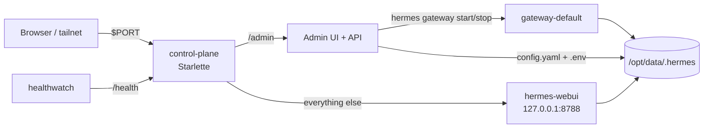

# Hermes All-in-One — WebUI + Admin Panel + Gateway in one container

One container that runs [Hermes Agent](https://github.com/NousResearch/hermes-agent) with a browser chat UI, a browser setup panel, and a multi-channel gateway (Telegram / Discord / Slack / Email) sharing **one** agent identity, memory, skills, and `SOUL.md`.

No terminal setup. Deploy it, open `/admin`, paste an API key, connect a channel.

| | |
|---|---|
| **Package version** | `0.12.0` |
| **Base image** | `nousresearch/hermes-agent:v2026.8.31` |
| **Vendored** | agent `v2026.8.31` · webui `v0.52.113` · vault `v0.25.0` |
| **Published image** | `ghcr.io/tyrliang/hermes-all-in-one:v0.12.0` / `:latest` |
| **Volume mount** | `/opt/data` (required) |
| **Public port** | `$PORT` (Railway-injected) or `8787` |

**Two audiences, two sections:**

- **[For agents](#for-agents)** — operating contract, invariants, deterministic setup and verification commands. Read this if you are an AI agent asked to deploy, operate, or modify this repo.
- **[For humans](#for-humans)** — first-time setup walkthrough with screenshots, provider/channel guides, first prompts, troubleshooting.

Shared reference used by both: **[Environment variable reference](#environment-variable-reference)** · **[Data on the volume](#data-on-the-volume)** · **[Architecture](#architecture)** · **[Releases & versioning](#releases--versioning)**

---
---

# For agents

Deterministic operating contract. Every statement here is verifiable in-tree. Do not infer beyond it.

## Ground truth

| Fact | Value | Source |
|---|---|---|
| What this repo is | Deployment wrapper: control plane + WebUI proxy + s6 service definitions. Agent logic is upstream, vendored, **not** authored here. | `Dockerfile`, `control_plane/` |
| Base image | `nousresearch/hermes-agent` pinned by `ARG HERMES_IMAGE` | `Dockerfile:7` |
| PID 1 | `/init` (s6-overlay), inherited ENTRYPOINT; `CMD ["sleep","infinity"]` holds the tree | `Dockerfile:181-183` |
| Public listener | `uvicorn control_plane.server:app` on `${CONTROL_PLANE_HOST}:${PORT:-8787}` | `docker/s6-rc.d/control-plane/run:25-27` |
| Internal WebUI | `vendor/hermes-webui/server.py` on `127.0.0.1:8788`, loopback only, reverse-proxied | `docker/s6-rc.d/hermes-webui/run:22-26`, `control_plane/proxy.py` |
| Gateway | s6 slot `/run/service/gateway-default`, driven by `hermes gateway start\|stop` | `control_plane/gateway_manager.py:19`, `control_plane/s6_ops.py:69-81` |
| Volume | `/opt/data` = `HERMES_DATA_DIR`; agent state in `/opt/data/.hermes` | `Dockerfile:165-166` |
| Supervision switch | s6 mode iff `CONTROL_PLANE_RUNTIME=s6`; otherwise control plane subprocess-manages children | `control_plane/runtime_mode.py:6-7` |
| Config writes | provider → `config.yaml` (`model.*`) + `.env` (api key); channels → `.env` only | `control_plane/config.py:189-224`, `319-323` |

## Repo map

| Path | Role | Edit here when |
|---|---|---|
| `control_plane/` | Starlette app: `/admin`, `/admin/api/*`, `/health`, catch-all WebUI proxy | Admin UI, auth, provider/channel persistence, gateway control |
| `docker/cont-init.d/` | One-shot boot scripts `03`→`06` (volume bootstrap, tailscale env, PATH, ssh keys) | Volume layout, env fan-out into `/run/s6/container_environment` |
| `docker/s6-rc.d/` | Longrun definitions: `control-plane`, `hermes-webui`, `tailscaled`, `lightpanda`, `healthwatch` | Service lifecycle, ports, boot deps |
| `docker/scripts/` | `hermes-with-vault` (gateway pre-exec shim), `hermes-vault-env-inject.py`, `gateway_autostart.py` | Vault secret injection |
| `docker/sshd/`, `docker/profile.d/` | sshd config (loopback:22), `HOME=/opt/data` forcing | SSH / interactive-shell behavior |
| `scripts/` | Version + release + vendor-sync + smoke tooling | Release mechanics |
| `vendor/` | `git subtree` copies of hermes-agent, hermes-webui, hermes-vault | **Never hand-edit**; only via sync tooling |
| `tests/` | `unittest`-style tests for control plane + vault inject | Behavior changes in `control_plane/` or vault shim |

## Invariants — do not break these

1. **`/opt/data` is the only durable state.** No feature may depend on anything outside it surviving a redeploy. Wiping it destroys agent memory, Tailscale node identity, TLS certs, SSH keys, and the admin signing key.
2. **The internal WebUI stays on `127.0.0.1:8788`.** It is unauthenticated at the socket level; the control plane is the only intended ingress. Binding it to `0.0.0.0` is a security regression.
3. **Never set `PORT` in Railway variables.** The platform injects it (usually `8080`); hardcoding desyncs routing. `8787` is a code default for local use only.
4. **Vendor trees are read-only.** Refresh via `scripts/sync-upstreams.sh` or the `sync-upstreams` workflow. A local patch to a vendor tree must be re-applied after every sync and recorded in the sync commit message (precedent: `b3c09890db`).
5. **`hermes` on `PATH` inside the image is the vault shim**, not the stock console script. Stock is preserved at `/opt/hermes/.venv/bin/hermes.stock.bak` (`Dockerfile:135-136`). Do not overwrite the shim without preserving the pre-exec inject.
6. **`TERMINAL_HOME_MODE=real` is forced** at the s6 container-environment level (`docker/cont-init.d/05-hermes-path:27`). Upstream defaults to an isolated fake home at `${HERMES_HOME}/home`, which scatters pip/npm state and loses it on rebuild. Do not revert to isolated mode.
7. **Minor version bumps are reserved for upstream base advances.** See [Releases & versioning](#releases--versioning). Everything else is a patch, no matter how large.
8. **`git tag` is manual.** No workflow auto-tags on `VERSION` change. Pushing to `main` publishes nothing.

## Deterministic setup — Railway

```
1. Create service from this repo (Dockerfile + railway.toml auto-detected).
2. Volumes tab → mount persistent volume at exactly /opt/data.
3. Variables tab → set:
     HERMES_WEBUI_PASSWORD=<strong>
     HERMES_ADMIN_PASSWORD=<different-strong>
   Do NOT set PORT. Do NOT set CONTROL_PLANE_HOST.
4. Deploy. /health returns 200 within ~30s of container start.
5. Open https://<service>.railway.app/admin → log in with HERMES_ADMIN_PASSWORD.
6. Providers → provider + model + API key → Save.
7. Channels → channel token → Save.
8. Gateway autostarts once a provider AND a channel are both valid.
9. Users → approve the pairing code the bot DMs to the first unknown user.
```

Failure mode to expect if step 3 is skipped: `HERMES_ADMIN_PASSWORD` empty **and** `HERMES_WEBUI_PASSWORD` empty ⇒ `admin_auth_enabled()` is false ⇒ `/admin` is fully open to the internet (`control_plane/auth.py:45-46`, `94-97`).

## Deterministic setup — local

```bash
cp .env.example .env
# set at minimum HERMES_WEBUI_PASSWORD and HERMES_ADMIN_PASSWORD
docker compose up -d --build
```

- Compose publishes `8787:8787`, bind-mounts `./.hermes-data:/opt/data`, and defaults both passwords to `test` (`docker-compose.yml:17-22`).
- `docker-compose.yml` only forwards the two password variables. To exercise Tailscale locally you must create `docker-compose.override.yml` yourself — it is **gitignored** (`.gitignore:27`), not shipped.
- `start.sh` is a non-image dev fallback: it defaults to `/data`, not `/opt/data`, does **not** set `CONTROL_PLANE_RUNTIME=s6`, and runs no s6, tailscaled, lightpanda, or healthwatch (`start.sh:6-16`). Prefer compose.

## Verification

Never claim a deploy works without one of these.

```bash
# 1. Liveness + readiness. /health is ALWAYS HTTP 200; readiness is the JSON status field.
curl -s http://127.0.0.1:8787/health | python3 -m json.tool
#   {"status":"ok"|"degraded","service":"hermes-control-plane",
#    "webui":{...},"gateway":{"running":bool,"healthy":bool}}
#   status == "ok" iff the internal WebUI answered 2xx on /health within 2s.

# 2. Admin auth gate is armed (must be 401, not 200).
curl -s -o /dev/null -w '%{http_code}\n' http://127.0.0.1:8787/admin/api/status

# 3. Full authenticated status (paths, supervisors, autostart eligibility).
curl -s -c /tmp/c -b /tmp/c -d 'password=<admin>' http://127.0.0.1:8787/admin/login >/dev/null
curl -s -b /tmp/c http://127.0.0.1:8787/admin/api/status | python3 -m json.tool

# 4. Service state (s6 binaries are only on PATH inside supervised processes).
docker compose exec hermes /command/s6-svstat /run/service/control-plane
docker compose exec hermes /command/s6-svstat /run/service/hermes-webui
docker compose exec hermes /command/s6-svstat /run/service/gateway-default

# 5. Full build + runtime contract (what CI runs).
./scripts/smoke.sh                 # SMOKE_SKIP_BUILD=1 to reuse an existing image
```

`scripts/smoke.sh` asserts, among other things: `/health` shape and `status == "ok"`, WebUI `supervisor == "s6"`, the `/admin` 401 gate, `/admin/api/status` paths equal to the `/opt/data/.hermes/*` contract, pairing APIs returning lists, vault tooling present, and that `/opt/data/.admin_signing_key` survives a container restart (`scripts/smoke.sh:141-292`).

Python tests:

```bash
python3 -m unittest discover -s tests -v
```

## Change protocol

| Change | Touch | Gate |
|---|---|---|
| Admin UI / API / auth | `control_plane/` (+ `tests/test_control_plane.py`) | `python3 -m unittest discover -s tests`, then `./scripts/smoke.sh` |
| Boot / volume layout | `docker/cont-init.d/*` | `dash -n` **and** `shellcheck` clean; smoke covers volume bootstrap |
| Service lifecycle / ports | `docker/s6-rc.d/<svc>/{type,run,dependencies.d}` + `user/contents.d/<svc>` marker | `dash -n`, smoke |
| Vault injection | `docker/scripts/hermes-with-vault`, `hermes-vault-env-inject.py` (+ `tests/test_vault_gateway_inject.py`) | unittest + smoke |
| New env var | consume it in code, **then** add it to `.env.example` **and** the [reference table](#environment-variable-reference) | both, or it is undocumented drift |
| Upstream bump | `./scripts/bump-hermes.sh <tag>` (writes `hermes-base`, `agent-base`, and `Dockerfile` `ARG HERMES_IMAGE`) | CI + manual tag |
| Anything else | `./scripts/bump-patch.sh` (patch only, never touches the Dockerfile) | CI + manual tag |

CI required checks are the exact job names **`vendor syntax`** and **`smoke`** (`.github/workflows/ci.yml:26-27,61-62`); branch protection is strict, so a PR must be up to date with `main`.

## Known traps

| Trap | Reality |
|---|---|
| `HERMES_ADMIN_USERNAME` | Read into `ADMIN_USERNAME` and then **never used**. Admin login is password-only. `control_plane/config.py:28` |
| `HERMES_GATEWAY_AUTOSTART=1` | Does **not** force a start. `1/true/yes/on/enabled` and the default `auto` follow the same path: both still require a valid provider **and** a configured channel. Only `0/false/no/off/disabled` changes behavior. `control_plane/config.py:306-317` |
| Saving a Telegram/Discord token in `/admin` | Clears `TELEGRAM_ALLOWED_USERS` / `DISCORD_ALLOWED_USERS` unless the same request also sends them. Deliberate: the image steers to pairing, not static allowlists. `control_plane/server.py:277-280` |
| Admin sessions | In-process dict, not persisted. Any control-plane restart logs every admin out. `control_plane/auth.py:19,62-64` |
| `/health` status code | Always 200, by design, so Railway liveness never flaps. Degradation is in the body only. `control_plane/server.py:129-148` |
| Red lines in Railway logs | s6, cont-init and Tailscale write informational output to **stderr**, so Railway tags it `severity: error`. Look for non-zero exits, crash loops, HTTP 5xx — not colored lines. |
| `scripts/sync-upstreams.sh` and the vault | The **script** syncs only `vendor/hermes-agent` + `vendor/hermes-webui` and advances no pins. Only the **workflow** syncs the vault and writes `*_base` pins. `scripts/sync-upstreams.sh:71-72` vs `.github/workflows/sync-upstreams.yml:64-147` |
| `.github/workflows/test.yml` | A `workflow_dispatch`-only `echo hello` stub. Not a test suite. |
| `check-upstream` workflow | Needs `secrets.SYNC_PAT`; there is no `GITHUB_TOKEN` fallback, so the PR step fails silently-ish without it. `sync-upstreams` does fall back. |
| `git tag --list 'v0.*'` | ~1340 tags, mostly dragged in by vendored subtrees (`v0.52.*` = webui, `v2026.*` = agent). Resolve this repo's releases with `git tag --merged HEAD`. |
| tailscaled dependency | `control-plane` depends on the tailscaled **slot**, which holds open via `sleep infinity` when `TAILSCALE_AUTH_KEY` is unset. It does not wait for a live tailnet join. |

---
---

# For humans

## First time here? Go to `/admin`, not `/`

Your deploy opens at `/`. That is the Hermes chat UI, and it needs a password plus a configured AI provider before it does anything. Configure it first:

```
https://your-app.railway.app/admin
```

Log in with `HERMES_ADMIN_PASSWORD` (or `HERMES_WEBUI_PASSWORD` if you only set that one). That is where you set your API key, connect channels, approve users, and control the gateway.

| Surface | URL | What it is |
|---|---|---|
| **WebUI** | `/` | Hermes chat interface in the browser |
| **Control Plane** | `/admin` | Provider + channel setup, gateway controls, user pairing, logs |
| **Health** | `/health` | Liveness JSON for `railway.toml` and load balancers |

Everything shares one Hermes identity — same memory, skills, config and `SOUL.md` — whether you talk on Telegram or in the browser.

**Admin Control Plane** — `/admin`


**Hermes WebUI** — `/`


## 1. Deploy

### Railway (recommended)

Create a new Railway service from this repo. `Dockerfile` and `railway.toml` are picked up automatically.

**a. Add a volume.** Railway → your service → **Volumes** → mount at exactly **`/opt/data`**.

> Without a volume, every redeploy wipes your agent's memory, config, credentials, Tailscale identity and SSH keys.

**b. Set the two required variables.** Railway → **Variables**:

```
HERMES_WEBUI_PASSWORD=your-secure-password
HERMES_ADMIN_PASSWORD=a-different-secure-password
```

Both should be set **before** the service becomes publicly reachable. If both are empty, `/admin` has no password at all.

**c. Deploy.** `/admin` is ready roughly 30 seconds after the container starts.

Railway networking rules:

- **Do not set `PORT`.** Railway injects it (often `8080`).
- The public listener is the control plane on `0.0.0.0:$PORT`. The WebUI deliberately binds `127.0.0.1:8788` and is reached through the control-plane proxy — that loopback bind is correct.
- `CONTROL_PLANE_HOST=0.0.0.0` is already baked into the image; you do not need to set it.
- Mount at `/opt/data`, not `/data`.

### Local (Docker Compose)

```bash
cp .env.example .env    # set HERMES_WEBUI_PASSWORD and HERMES_ADMIN_PASSWORD
docker compose up -d --build
```

| Surface | URL |
|---|---|
| WebUI | http://127.0.0.1:8787/ |
| Admin | http://127.0.0.1:8787/admin |
| Health | http://127.0.0.1:8787/health |

State lives in `./.hermes-data` (bind-mounted at `/opt/data`, agent files under `.hermes/`). Configure your provider at `/admin` exactly as in production.

Useful commands:

```bash
docker compose logs -f hermes
docker compose exec hermes zsh          # interactive shell as root
docker compose exec --user hermes hermes zsh   # as the user the app runs as
docker compose down                     # stop and remove
docker compose up -d --build            # rebuild after Dockerfile changes
```

### Pre-built image

```bash
docker run -d --name hermes-all-in-one \
  -p 8787:8787 \
  -e HERMES_WEBUI_PASSWORD=your-password \
  -e HERMES_ADMIN_PASSWORD=your-admin-password \
  -v "$(pwd)/.hermes-data:/opt/data" \
  ghcr.io/tyrliang/hermes-all-in-one:latest
```

## 2. Pick an AI provider

`/admin` → **Providers** → choose → paste key → **Save**. Four setups are supported in the browser:

| Provider | Env key written | Default model offered | Notes |
|---|---|---|---|
| **OpenRouter** | `OPENROUTER_API_KEY` | `anthropic/claude-sonnet-4.6` | Best starting point — one key, hundreds of models |
| **Anthropic** | `ANTHROPIC_API_KEY` | `claude-sonnet-4.6` | Key from [console.anthropic.com](https://console.anthropic.com) |
| **OpenAI** | `OPENAI_API_KEY` | `gpt-4o` | Base URL defaults to `https://api.openai.com/v1` |
| **Custom OpenAI-compatible** | `OPENAI_API_KEY` | `gpt-4o-mini` | Base URL **required**. Ollama, LM Studio, vLLM, Together, Groq… |

The API key is written to `/opt/data/.hermes/.env`; `model.provider`, `model.default` and optional `model.base_url` go to `/opt/data/.hermes/config.yaml`. The key is never displayed again — re-entering it is required on every save.

**Not available in the browser:** OAuth and subscription flows — OpenAI Codex / ChatGPT login, Nous Portal, GitHub Copilot. Those are terminal-first:

```bash
# Railway
npm install -g @railway/cli && railway login && railway ssh
# or locally: docker compose exec --user hermes hermes zsh

hermes auth login      # credentials land under /opt/data/.hermes
```

Afterwards the provider shows as configured in `/admin`.

## 3. Connect a channel

`/admin` → **Channels**. Four are configurable from the browser; WhatsApp only shows status if it was enabled externally.

| Channel | Fields in the UI | Env keys |
|---|---|---|
| **Telegram** | Bot token | `TELEGRAM_BOT_TOKEN`, `TELEGRAM_ALLOWED_USERS` |
| **Discord** | Bot token | `DISCORD_BOT_TOKEN`, `DISCORD_ALLOWED_USERS` |
| **Slack** | Bot token + app token | `SLACK_BOT_TOKEN`, `SLACK_APP_TOKEN` |
| **Email** | Address + password | `EMAIL_ADDRESS`, `EMAIL_PASSWORD` |
| **WhatsApp** | status chip only | `WHATSAPP_ENABLED` |

Telegram in three steps:

1. DM [@BotFather](https://t.me/BotFather), send `/newbot`, copy the token (`123456789:ABCdef...`).
2. Paste it into `/admin` → Channels → Telegram → Save.
3. Message your bot.

The gateway starts automatically as soon as **one valid provider** and **one configured channel** both exist.

## 4. Approve yourself (pairing)

You do not need to hunt for numeric user IDs any more. When an unrecognized user DMs the bot, Hermes replies with an 8-character pairing code (valid 1 hour, rate-limited to one request per user per 10 minutes).

Approve it in `/admin` → **Users**: pending codes appear there, and you click **Approve**. The equivalent CLI is `hermes pairing approve <platform> <code>`.

The same panel lists approved users and lets you revoke them. Pairing state lives in `/opt/data/.hermes/pairing/`.

If you genuinely want an open bot, Channels → **Allow all users** sets `GATEWAY_ALLOW_ALL_USERS=true` and skips allowlists and pairing entirely. Use with care.

> Note: saving a Telegram or Discord bot token from `/admin` clears that platform's static allowlist, on purpose — pairing is the intended path.

## 5. Also in `/admin`

- **Overview** — gateway and WebUI state, uptime, autostart eligibility, resolved paths.
- **Gateway** — Start / Stop / Restart. The gateway is considered healthy once it has run ≥3 s without crashing (it is a bot process, not an HTTP server, so there is no endpoint to probe).
- **Restart WebUI** — without restarting the container.
- **Logs** — live tails of `gateway.log` and the WebUI log.
- Status refreshes every 5 s.

## 6. Your first prompts

Hermes is deployed but blank. The first ten minutes shape how useful it is for the rest of its life.

**Onboard it to itself:**

```
Use your hermes-agent skill and help me with first-time setup.
Read your own documentation, understand what you're capable of, then walk me
through how to make you as useful as possible for someone who just deployed
you. Start by asking what I do, what I want to automate, and what help I need
daily. Then suggest what to set up first.
```

**Onboard it to you:**

```
I want to brief you on who I am so you can serve me better. Ask me these one
at a time, waiting for each answer:
  1. What do you do for work, or what are you building?
  2. What's your biggest time drain right now?
  3. What do you wish you had a daily assistant for?
  4. Which tools do you use most (Notion, Gmail, Telegram, ...)?
  5. What have you always wanted to automate but never had time to set up?
Then summarize who I am, save it to your memory, and suggest the three most
valuable things to set up first.
```

**Give it a new capability:**

```
Show me your available skills with /skills. Then find something useful for
[your goal] in the skills hub, install it, and show me how to use it.
```

## 7. Skills

Skills are already running — nothing to set up. Hermes indexes its skills directory at the start of every conversation and injects the index into its own system prompt, then loads a skill's procedures automatically when your request matches. A skill is just a Markdown file:

```
/opt/data/.hermes/skills/
  github-code-review/
    SKILL.md         ← frontmatter + instructions
    references/      ← optional supporting docs
```

Three layers: **built-in** (seeded onto the volume on first boot), **optional** (`/opt/data/.hermes/optional-skills/`, installed on demand), and **community** at [agentskills.io](https://agentskills.io).

```
/skills                              # what's active
/skills install arxiv                # from the optional library
/skills search "cold email"          # community hub
```

If nothing fits, describe the workflow once and ask Hermes to save it as a skill. After a successful multi-step task, this works well:

```
That worked. Write a skill capturing this workflow so you can do it faster
next time without my instructions. Check existing skills first to avoid
duplicates.
```

## 8. Scheduling and automations

Built-in cron, natural language or crontab syntax:

```bash
hermes cron create "every day at 8am" "your prompt" --name "My Task" --deliver telegram
hermes cron create "0 8 * * 1-5" "your prompt" --name "Weekday Briefing" --deliver telegram
```

Delivery targets: `--deliver telegram | discord | slack | local`.

**Script injection** runs a Python script first and feeds its output to the agent as context — mechanical work outside the LLM, reasoning inside it:

```bash
hermes cron create "every 1h" \
  "If CHANGE DETECTED, summarize what changed and why it matters. If NO_CHANGE, reply [SILENT]." \
  --script ~/.hermes/scripts/watch-prices.py \
  --name "Price Monitor" --deliver telegram
```

`[SILENT]` is the key pattern: notify only when something actually changed.

Chain skills into a job with `--skills "arxiv,obsidian"`. Full docs: [hermes-agent cron features](https://hermes-agent.nousresearch.com/docs/user-guide/features/cron).

A worked example to paste as-is:

```
Create a daily intelligence briefing at 7am, delivered to Telegram.
My interests: [...]. Skip: [...].
Sources: Hacker News top 10, TechCrunch, The Verge, r/MachineLearning, trending arXiv CS.
Per item: title + link, 2-sentence summary, why it matters to me, and the "so what".
Limit to the 5 most relevant. Name it "Morning Briefing" and schedule it.
```

## 9. Your agent's identity — `SOUL.md`

`SOUL.md` controls the persistent persona: name, voice, priorities. It lives at `/opt/data/.hermes/SOUL.md`.

Edit it from the WebUI, then `/admin` → Overview → **Restart** the gateway to apply. 200 words of well-crafted identity beats 2000 words of prompt stuffing. Formatting guidance: [Hermes Agent docs](https://github.com/NousResearch/hermes-agent).

## 10. The self-learning loop

1. **Memory nudges** — after complex conversations the agent prompts itself to save what it learned about you.
2. **Session search** — every conversation is FTS5-indexed; `/insights` shows what it knows.
3. **Skill creation** — a completed multi-step task can become a skill it wrote itself.
4. **User modeling** — via [Honcho](https://github.com/plastic-labs/honcho), it builds a model of your preferences and working style.
5. **Skill improvement** — skills get sharper as it finds better approaches.

Practical consequence: month 3 is not the same agent as day 1. Which is also why the volume matters.

---

# Optional extras

## Tailscale — private access

Railway blocks `NET_ADMIN` and `/dev/net/tun`, so this image runs Tailscale in **userspace networking**. With no `TAILSCALE_AUTH_KEY`, the service is a no-op that just holds its s6 slot; local and compose behavior is unchanged.

When enabled, the container joins your tailnet and `http://<magicdns>:$PORT/` serves the same `/`, `/admin`, `/health`.

**Minimum:**

```
TAILSCALE_AUTH_KEY=tskey-auth-...
TAILSCALE_HOSTNAME=hermes-all-in-one     # defaults to $RAILWAY_SERVICE_NAME, then hermes-all-in-one
```

Create an [auth key](https://tailscale.com/kb/1085/auth-keys) in the Tailscale admin console. Disable the public Railway URL if you want tailnet-only access. After the first join, restarts reuse machine credentials in `/opt/data/.tailscale/` even if the key expired — you only need a fresh key when that state is wiped or the machine is removed from the tailnet.

### HTTPS on the tailnet

`TAILSCALE_HTTPS=1` runs `tailscale serve --bg --https=443 http://127.0.0.1:$PORT` after join, giving you `https://<hostname>.<tailnet>.ts.net/` with a Let's Encrypt certificate.

- Prerequisites your tailnet admin must enable (the image cannot): **MagicDNS** and **HTTPS Certificates**.
- **Cert-additive, not TLS-only**: plain `http://<magicdns>:$PORT/` stays open.
- cont-init sets `HERMES_WEBUI_TRUST_FORWARDED_PROTO=1` so WebUI auth cookies get the `Secure` flag on the HTTPS path. **Prefer the HTTPS URL for login.**
- Certs live under `/opt/data/.tailscale/`, sharing the volume with machine credentials. Wiping that directory forces a new node **and** re-issues certificates (Let's Encrypt allows 5 duplicate certs per name per week). Rotate the auth key instead of wiping state.

Serve config is persisted node state, so every boot reconciles it against your env **one handler at a time** — applying what you asked for and disabling only what the image itself owns. There is no global `serve reset`, so handlers you added on other ports (including Funnel) are never touched. Port 22 is reconciled unconditionally, since the image has owned it since `TAILSCALE_SSH=openssh` became the default. Port 443 is only disabled when the image enabled it, tracked by `/opt/data/.tailscale/.serve-https-managed`. Every serve failure is non-fatal: nothing is torn down before a re-apply, so a working handler survives and the service logs a warning.

Check it:

```bash
# Local compose
docker exec hermes-all-in-one tailscale --socket=/run/tailscale/tailscaled.sock serve status

# Railway — no docker exec. Reach the box over tailnet SSH as `hermes`. The certs
# directory is root-owned 0700 with no sudo, so inspect the live cert off the wire:
ssh hermes@<host>.<tailnet>.ts.net tailscale --socket=/run/tailscale/tailscaled.sock serve status
echo | openssl s_client -connect <host>.<tailnet>.ts.net:443 -servername <host>.<tailnet>.ts.net 2>/dev/null \
  | openssl x509 -noout -serial -dates -subject
```

### Shell over the tailnet

Default is **OpenSSH + `tailscale serve --tcp 22`**, i.e. normal `ssh` with a public key on the volume.

| `TAILSCALE_SSH` | Behavior |
|---|---|
| `openssh` / `1` / `true` / `yes` (**default**) | `sshd` on `127.0.0.1:22` + `tailscale serve --tcp 22`; keys from `/opt/data/.ssh/authorized_keys` |
| `tailscale` | Tailscale SSH (`tailscale up --ssh`). Unreliable under userspace networking: TCP to 22 connects and `RunSSH` is true, but the server often never sends a banner, so clients hang right after `Local version string SSH-2.0-…`. Not an ACL problem. |
| `0` / `false` / `off` / `no` | Off |

Add your key the easy way — Railway → **Variables** (multiline is fine for several keys):

```
TAILSCALE_SSH_AUTHORIZED_KEYS=ssh-ed25519 AAAA...comment
```

cont-init merges it into `/opt/data/.ssh/authorized_keys` on every boot, idempotently, keeping keys already on the volume. Then:

```bash
ssh hermes@<your-magicdns-name>
```

Host keys are generated once into `/opt/data/.ssh/host/` (root-owned, `0700`) so redeploys keep the same fingerprint. `authorized_keys` is `hermes`-owned `0600`. **Do not `chown -R hermes` the whole `.ssh` tree** — that breaks host-key permissions. If you carry a stale fingerprint from a much older image: `ssh-keygen -R <your-magicdns-name>`.

ACL note: if the node carries `tag:server`, only rules with `dst: ["tag:server"]` apply — `autogroup:self` will not match.

`railway ssh` remains available independently and works even with tailnet SSH off.

### Outbound through the tailnet

| Variable | Effect |
|---|---|
| `TAILSCALE_OUTBOUND_PROXY=1` | Sets `ALL_PROXY=socks5://127.0.0.1:1055/` plus `HTTP_PROXY`/`HTTPS_PROXY` and a `NO_PROXY` list covering loopback and `*.railway.internal`, so app traffic can reach tailnet peers (homelab DB, etc.) |
| `TAILSCALE_NO_PROXY_EXTRA=host,.domain` | Extra `NO_PROXY` entries for APIs that must not traverse the proxy (public LLM endpoints, for instance) |
| `TAILSCALE_ACCEPT_ROUTES=1` | Reach LAN prefixes advertised by a subnet router (e.g. `192.168.88.0/24`). Requires `TAILSCALE_OUTBOUND_PROXY=1` — userspace has no kernel routes, so the SOCKS proxy is what dials accepted prefixes. Approve the routes in the admin console. |
| `TAILSCALE_EXIT_NODE=<peer>` | Internet egress via a tailnet exit node, so sites that block datacenter IPs see a residential address. Peer base name, MagicDNS name, or `100.x.y.z`. The peer must run `tailscale set --advertise-exit-node` and be approved. Pair with `TAILSCALE_OUTBOUND_PROXY=1`; only proxied traffic exits via the node, direct sockets still use the host IP. Unset/empty means the image passes no `--exit-node` and does not clear a preference you set by hand. |

```bash
tailscale status | grep 'exit node'
curl -s https://ipinfo.io/ip     # should be the exit node's IP, not Railway's
```

Expect one-time boot noise with the outbound proxy on: `TPM`, UDP buffer size, `profile not found`, brief `connection refused` on `127.0.0.1:1055` before the userspace proxy is listening. Once you see `joined tailnet` and `Switching ipn state … -> Running`, it is healthy.

### PMTU black holes

Symptom from some client networks (corporate NAT, PPPoE, ICMP-dropping firewalls): `curl -I` succeeds but a full `curl` returns an empty body; `ping -s 1220` works and `ping -s 1230` does not. Tailscale's default 1280 tunnel MTU negotiates an MSS near 1240, above the real path MTU.

Railway blocks `NET_ADMIN`, so an iptables MSS clamp is unavailable. The image therefore sets `TS_DEBUG_MTU=1200` by default whenever Tailscale is enabled (log line: `[tailscaled] TS_DEBUG_MTU=1200`). Tune with `TAILSCALE_MTU=1100` for tighter paths, or `TAILSCALE_MTU=0` to fall back to Tailscale's 1280.

To confirm before redeploying, temporarily lower the MTU on your Mac's Tailscale interface: `sudo ifconfig utun<N> mtu 1220` (find it with `ifconfig | grep -B1 "100\."`).

## Hermes Vault — secrets off the volume

[Hermes Vault](https://github.com/asimons81/hermes-vault) is vendored and baked in, so credentials can live as `hv://` bindings instead of plaintext in `.env`. Plaintext `.env` and `/admin` still work; the vault is optional.

| Path | Role |
|---|---|
| `/usr/local/bin/hermes-vault` | CLI, isolated venv at `/opt/hermes-vault` |
| `/opt/hermes/plugins/hermes-vault-secret-source/` | Bundled Secret Source plugin, discovered every boot |
| `/opt/hermes/.venv/bin/hermes` | **Gateway vault shim** — preloads `hv://` secrets before `hermes gateway run` |
| `/opt/hermes/.venv/bin/hermes.stock.bak` | The stock console script, kept for reference |
| `/app/docker/scripts/hermes-vault-env-inject.py` | Fetch helper the shim calls |

**Why the shim exists.** Hermes applies secret sources during the first `load_hermes_dotenv()`, which runs *before* Python plugins are discovered. Cron sessions re-pull secrets and keep working; the gateway parent does not. With a vault-only `TELEGRAM_BOT_TOKEN` that gives you outbound cron → Telegram working while inbound DMs get no reply. The shim materializes the vault env into the process before importing `hermes_cli.main`, so the stock s6 `hermes gateway run` invocation still receives the tokens.

Setup:

```bash
HERMES_VAULT_PASSPHRASE=...        # platform secret — never on the volume
# optional:
# HERMES_VAULT_HOME=/opt/data/.hermes/hermes-vault-data
```

```yaml
# /opt/data/.hermes/config.yaml
secrets:
  sources:
    - hermes_vault
  hermes_vault:
    binary: hermes-vault
    env:
      TELEGRAM_BOT_TOKEN: hv://telegram
      # OPENROUTER_API_KEY: hv://openrouter
```

Restart the gateway, then verify (names and lengths only, never values):

```bash
python3 /app/docker/scripts/hermes-vault-env-inject.py --check
cat /opt/data/.hermes/hermes-vault-data/last-env-inject.json
```

## Lightpanda — headless browser backend

A CDP-speaking headless browser pinned to `0.3.7`, verified against the published SHA256 at build time, telemetry disabled. Off by default; the s6 service holds its slot, so enabling it is only an env change.

```
LIGHTPANDA_ENABLED=1
```

It then serves CDP on `127.0.0.1:9222`. Point Hermes at it with `browser.cdp_url: http://127.0.0.1:9222` in `config.yaml` — the attach path. The `--engine lightpanda` spawn path is broken upstream ("Multiple targets"). `LIGHTPANDA_BIN` overrides the binary location.

## Self-heal watchdog

The `healthwatch` service polls `http://127.0.0.1:${PORT}/health` every 20 s. If the body has not contained `"status": "ok"` for a continuous 480 s, it writes exit code `1` into the s6 container results and halts the container, so Railway's `restartPolicyType = "ON_FAILURE"` redeploys it. It recycles the whole container rather than individual services.

Tune with `HEALTHWATCH_INTERVAL_SECONDS`, `HEALTHWATCH_GRACE_SECONDS`, or disable with `HEALTHWATCH_ENABLED=0`.

## Interactive shell notes

`s6` binaries live under `/command/` and are only on `PATH` inside supervised processes. Use full paths by hand:

```bash
/command/s6-svstat /run/service/gateway-default
```

Node 22 is baked in at `/usr/local/bin/node`. Some shells (notably `railway ssh`) start with a minimal `PATH`; cont-init patches this for current deploys, but if `hermes --tui` ever offers to install Node:

```bash
export PATH="/usr/local/bin:/opt/hermes/bin:/opt/hermes/.venv/bin:$PATH"
hermes --tui
```

The browser WebUI is generally a better fit than the TUI on Railway — Ink wants a real TTY. Use the TUI locally via `docker compose exec`.

## Troubleshooting

| Symptom | Cause / fix |
|---|---|
| `/admin` shows the chat UI, or hangs | Your browser cached the WebUI **service worker** from an earlier visit and it intercepts `/admin` navigations. Hard-refresh, use a private window, or unregister the service worker for that host. |
| `/health` says `degraded` | The internal WebUI did not answer `127.0.0.1:8788/health` within 2 s. Check `/command/s6-svstat /run/service/hermes-webui` and the WebUI log tail in `/admin` → Logs. |
| Gateway never starts | Autostart requires a valid provider **and** a configured channel. `/admin` → Overview shows `autostart_eligible`. `HERMES_GATEWAY_AUTOSTART=1` does not override this. |
| Cron delivers to Telegram but DMs get no reply | Vault-only `TELEGRAM_BOT_TOKEN` without the gateway shim path working. Run the `--check` above. |
| Logged out of `/admin` after a deploy | Admin sessions are in-process and do not survive a restart. Log in again. |
| Railway logs are full of red | s6, cont-init and Tailscale log informational output to stderr. Look for non-zero exits, crash loops and 5xx, not colored lines. |
| Everything forgot everything | The volume was replaced or unmounted. Back up `/opt/data` before any destructive volume operation. |

---
---

# Environment variable reference

Defaults below are what the **image** provides (`Dockerfile:161-177`) or what the consuming code falls back to. Anything marked *set by the image* should not normally appear in your platform variables.

## Required

| Variable | Default | Description |
|---|---|---|
| `HERMES_WEBUI_PASSWORD` | *(none)* | Password for the WebUI at `/`. Setting it also locks the in-UI password field. |
| `HERMES_ADMIN_PASSWORD` | falls back to `HERMES_WEBUI_PASSWORD`, then empty | Password for `/admin`. **If both are empty, admin auth is disabled entirely and `/admin` is open.** |

## AI provider — set via `/admin`, or manually

| Variable | Used by |
|---|---|
| `OPENROUTER_API_KEY` | OpenRouter |
| `ANTHROPIC_API_KEY` | Anthropic direct |
| `OPENAI_API_KEY` | OpenAI direct, and any custom OpenAI-compatible endpoint |

## Channels — set via `/admin`, or manually

| Variable | Default | Description |
|---|---|---|
| `TELEGRAM_BOT_TOKEN` | *(none)* | Bot token from [@BotFather](https://t.me/BotFather) |
| `TELEGRAM_ALLOWED_USERS` | *(none)* | Comma-separated **numeric** user IDs. Optional — pairing is the default path. Cleared when you save a bot token from `/admin` without also sending it. |
| `DISCORD_BOT_TOKEN` | *(none)* | Discord bot token |
| `DISCORD_ALLOWED_USERS` | *(none)* | Comma-separated Discord user IDs; same clearing behavior |
| `SLACK_BOT_TOKEN` | *(none)* | Slack bot token |
| `SLACK_APP_TOKEN` | *(none)* | Slack app-level token |
| `EMAIL_ADDRESS` | *(none)* | Mailbox address |
| `EMAIL_PASSWORD` | *(none)* | Mailbox password / app password |
| `WHATSAPP_ENABLED` | *(none)* | `1`/`true`/`yes`/`on` marks WhatsApp configured externally; not configurable from `/admin` |
| `GATEWAY_ALLOW_ALL_USERS` | *(none)* | `true` skips allowlists **and** pairing for every channel |

## Gateway

| Variable | Default | Description |
|---|---|---|
| `HERMES_GATEWAY_AUTOSTART` | `auto` | `0`/`false`/`no`/`off`/`disabled` = never autostart. `auto` (default) and `1`/`true`/`yes`/`on`/`enabled` both autostart **only** when a valid provider and a configured channel exist. |

## Control plane & WebUI

| Variable | Default | Description |
|---|---|---|
| `PORT` | `8787` | Public control-plane port. **Railway injects this — never set it there.** |
| `CONTROL_PLANE_PORT` | `8787` | Fallback used only when `PORT` is unset |
| `CONTROL_PLANE_HOST` | `0.0.0.0` *(set by the image)* | Public bind address |
| `CONTROL_PLANE_INTERNAL_WEBUI_HOST` | `127.0.0.1` *(set by the image)* | Internal WebUI host. Keep it loopback. |
| `CONTROL_PLANE_INTERNAL_WEBUI_PORT` | `8788` *(set by the image)* | Internal WebUI port |
| `CONTROL_PLANE_RUNTIME` | `s6` *(set by the image)* | `s6` = supervised services. Anything else makes the control plane subprocess-manage the WebUI and gateway (used by `start.sh` only). |
| `CONTROL_PLANE_STATUS_CACHE_TTL` | `2.0` | Seconds the `/admin` status JSON is cached |
| `HERMES_ADMIN_SESSION_TTL` | `86400` | Admin session lifetime in seconds |
| `HERMES_ADMIN_USERNAME` | `admin` | **No-op.** Read but never used — admin login is password-only. |
| `HERMES_WEBUI_TRUST_FORWARDED_PROTO` | set to `1` when `TAILSCALE_HTTPS=1` | Lets the WebUI mark auth cookies `Secure` behind Tailscale Serve |

## Tailscale (all optional)

| Variable | Default | Description |
|---|---|---|
| `TAILSCALE_AUTH_KEY` | *(none)* | Empty = the sidecar is a no-op. Set it to join your tailnet. Gates every other Tailscale feature. |
| `TAILSCALE_HOSTNAME` | `$RAILWAY_SERVICE_NAME`, else `hermes-all-in-one` | Tailnet node name |
| `TAILSCALE_SSH` | `openssh` | `openssh`/`1`/`true`/`yes` = OpenSSH + `serve --tcp 22`; `tailscale` = Tailscale SSH; `0`/`false`/`off`/`no` = off |
| `TAILSCALE_SSH_AUTHORIZED_KEYS` | *(none)* | Newline-separated public keys, merged into `/opt/data/.ssh/authorized_keys` each boot |
| `TAILSCALE_HTTPS` | off | `1`/`true`/`yes` = `serve --https=443` → `$PORT`. Cert-additive; requires MagicDNS + HTTPS Certificates on the tailnet. |
| `TAILSCALE_OUTBOUND_PROXY` | off | `1`/`true`/`yes` = set `ALL_PROXY`/`HTTP_PROXY`/`HTTPS_PROXY` to the userspace proxy on `127.0.0.1:1055` |
| `TAILSCALE_NO_PROXY_EXTRA` | *(none)* | Comma-separated extra `NO_PROXY` hosts |
| `TAILSCALE_ACCEPT_ROUTES` | off | `1`/`true`/`yes` = `--accept-routes`. Needs `TAILSCALE_OUTBOUND_PROXY=1`. |
| `TAILSCALE_EXIT_NODE` | *(none)* | Peer name, MagicDNS name, or `100.x.y.z`. Empty = pass no `--exit-node` and leave any manual preference alone. |
| `TAILSCALE_MTU` | `1200` when Tailscale is on | Exported as `TS_DEBUG_MTU` (PMTU workaround). `0`/`false`/`off`/`disable` = use Tailscale's 1280. |
| `TAILSCALE_STATE_DIR` | `${HERMES_DATA_DIR}/.tailscale` | Node state, profile and TLS certs |
| `TAILSCALE_SOCKET` | `/run/tailscale/tailscaled.sock` | tailscaled control socket |
| `RAILWAY_SERVICE_NAME` | *(platform-injected)* | Hostname fallback when `TAILSCALE_HOSTNAME` is unset |

## Hermes Vault (all optional)

| Variable | Default | Description |
|---|---|---|
| `HERMES_VAULT_PASSPHRASE` | *(none)* | Unlock secret. Required for `hv://` resolution. Keep it a platform secret, never on the volume. |
| `HERMES_VAULT_HOME` | `${HERMES_HOME}/hermes-vault-data` | Vault data directory and inject stamp |
| `HERMES_VAULT_BINARY` | auto-detected | Overrides CLI discovery (`/usr/local/bin/hermes-vault` → `/opt/hermes-vault/bin/hermes-vault` → `PATH`) |
| `HERMES_VAULT_INJECT_SCRIPT` | `/app/docker/scripts/hermes-vault-env-inject.py` | Helper the gateway shim executes |

## Lightpanda browser backend

| Variable | Default | Description |
|---|---|---|
| `LIGHTPANDA_ENABLED` | `0` | `1`/`true`/`on`/`yes` starts the CDP server on `127.0.0.1:9222` at boot |
| `LIGHTPANDA_BIN` | `/usr/local/bin/lightpanda` | Binary override |
| `LIGHTPANDA_DISABLE_TELEMETRY` | forced `true` | Set by the run script; not an operator knob |

## Watchdog

| Variable | Default | Description |
|---|---|---|
| `HEALTHWATCH_ENABLED` | `1` | `0`/`false`/`off`/`no` disables the self-heal loop |
| `HEALTHWATCH_INTERVAL_SECONDS` | `20` | Probe interval |
| `HEALTHWATCH_GRACE_SECONDS` | `480` | Continuous degraded time before the container halts with exit code 1 |

## Paths and internals — change only with a reason

| Variable | Default |
|---|---|
| `HERMES_DATA_DIR` | `/opt/data` (the volume mount point) |
| `HERMES_HOME` | `/opt/data/.hermes` (config, `.env`, sessions, skills, pairing) |
| `HERMES_CONFIG_PATH` | `/opt/data/.hermes/config.yaml` |
| `HERMES_WEBUI_STATE_DIR` | `/opt/data/webui` |
| `HERMES_WORKSPACE_DIR` | `/opt/data/workspace` |
| `HERMES_WEBUI_AGENT_DIR` | `/opt/hermes` (agent runtime from the base image) |
| `HOME` | `/opt/data` |
| `TERMINAL_HOME_MODE` | `real` — forced, so subprocesses use the persistent home instead of an isolated `${HERMES_HOME}/home` |
| `HERMES_NODE` | `/usr/local/bin/node` |
| `HERMES_DASHBOARD` | `0` — the upstream dashboard slot stays off |
| `PYTHONPATH` | `/app` |
| `SHELL` | `/bin/zsh` |

## Build args

| `ARG` | Default | Purpose |
|---|---|---|
| `HERMES_IMAGE` | `nousresearch/hermes-agent:v2026.8.31` | Base image pin; kept in sync with `hermes-base` in `VERSION` |
| `HERMES_WEBUI_VERSION` | `unknown` | Baked into the vendored WebUI's `_version.py` |
| `MICRO_VERSION` | `2.0.14` | `micro` editor for interactive shells |
| `LIGHTPANDA_VERSION` | `0.3.7` | Lightpanda release, SHA256-verified per arch |

```bash
docker build \
  --build-arg HERMES_IMAGE=nousresearch/hermes-agent:v2026.8.31 \
  --build-arg HERMES_WEBUI_VERSION=v0.12.0 \
  -t hermes-all-in-one .
```

## Smoke-test overrides

`scripts/smoke.sh` only: `SMOKE_IMAGE_TAG` (`hermes-control-plane-smoke:local`), `SMOKE_PORT` (`18787`), `SMOKE_CONTAINER_PORT` (`18999`), `SMOKE_DATA_DIR` (`./.tmp-smoke-data`), `SMOKE_PASSWORD` (`smoke-test-password`), `SMOKE_WEBUI_PASSWORD`, `SMOKE_ADMIN_PASSWORD`, `SMOKE_SKIP_BUILD` (`0`).

---

# Data on the volume

Everything durable lives under `/opt/data`. Below are the entries that matter; the agent creates more at runtime (`logs/`, `memories/`, `cron/`, `state.db`, caches, and an unused `home/` left over from the isolated-home default).

```
/opt/data/                       ← mount this (HERMES_DATA_DIR)
  .hermes/                       ← HERMES_HOME
    config.yaml                  ← provider + model config
    .env                         ← API keys and channel credentials
    SOUL.md                      ← agent identity
    sessions/                    ← conversation history per channel
    skills/                      ← seeded from the image on first boot
    optional-skills/             ← installable library
    pairing/                     ← *-pending.json, *-approved.json, _rate_limits.json (0600)
    hermes-vault-data/           ← vault data + last-env-inject.json (when vault is used)
  webui/                         ← WebUI state
  workspace/                     ← agent workspace
  .tailscale/                    ← node state, profile/, certs/, .serve-https-managed
  .ssh/                          ← authorized_keys (hermes 0600) + host/ (root 0700)
  .admin_signing_key             ← admin session HMAC key (0600)
```

`.tailscale/`, `.ssh/` and `hermes-vault-data/` only appear once the corresponding feature is enabled.

The WebUI and every gateway channel share this directory, which is the whole point:

- The agent remembers Telegram conversations when you switch to the WebUI.
- Skills added from one surface are available on the other.
- One personality, many frontends.

**Back up `/opt/data` before any destructive volume operation.**

Upgrading from `v0.1.3` or earlier (flat layout): on first start, cont-init moves agent files from `/opt/data/` into `/opt/data/.hermes/` when it finds `config.yaml` at the volume root. `webui/`, `workspace/` and `.admin_signing_key` stay in place.

---

# Architecture

```
Container (FROM nousresearch/hermes-agent)
│
├── PID 1: /init (s6-overlay — zombie reaping, service supervision)
│   ├── cont-init 03: volume bootstrap, legacy migration, skills + pairing seed
│   ├── cont-init 04: Tailscale proxy / forwarded-proto env fan-out
│   ├── cont-init 05: PATH, HERMES_NODE, TERMINAL_HOME_MODE=real
│   ├── cont-init 06: OpenSSH host keys + authorized_keys on the volume
│   │
│   ├── longrun tailscaled     → userspace tailnet, SOCKS/HTTP :1055   (no-op without an auth key)
│   ├── longrun hermes-webui   → vendor/hermes-webui/server.py 127.0.0.1:8788
│   ├── longrun control-plane  → uvicorn on 0.0.0.0:$PORT  (/, /admin, /health, proxy)
│   ├── longrun lightpanda     → CDP 127.0.0.1:9222        (no-op unless enabled)
│   ├── longrun healthwatch    → /health poll → container halt on sustained failure
│   └── dynamic gateway-default → hermes gateway (Telegram / Discord / Slack / Email)
│
└── CMD: sleep infinity
```


```mermaid
flowchart LR
  U["Browser / tailnet"] -->|"$PORT"| CP["control-plane<br/>Starlette"]
  CP -->|"/admin"| A["Admin UI + API"]
  CP -->|"everything else"| W["hermes-webui<br/>127.0.0.1:8788"]
  A -->|"hermes gateway start/stop"| G["gateway-default"]
  A -->|"config.yaml + .env"| V[("/opt/data/.hermes")]
  W --> V
  G --> V
  H["healthwatch"] -->|"/health"| CP
```

Boot dependencies: everything depends on the s6 `base` bundle; `control-plane` additionally depends on the `tailscaled` slot (which holds open via `sleep infinity` when Tailscale is disabled, so it never blocks startup).

The control plane is a thin Starlette wrapper — not a framework, not a product. It exists to:

1. Proxy the WebUI behind the public port.
2. Expose `/admin` for setup, pairing and gateway control.
3. Start/stop/restart the gateway through the official `hermes gateway` CLI and s6, never raw subprocesses.

---

# Releases & versioning

Two version concepts: this package's semver, and the upstream tags baked into the image.

## The `VERSION` file

```text
0.12.0
hermes-base=v2026.8.31
agent-base=v2026.8.31
webui-base=v0.52.113
vault-base=v0.25.0
```

| Line | Field | Meaning |
|---|---|---|
| 1 | package semver | GHCR tag + git tag: `v0.12.0` |
| 2 | `hermes-base` | Pinned `nousresearch/hermes-agent` tag in the Dockerfile |
| 3 | `agent-base` | Pinned upstream tag for `vendor/hermes-agent` |
| 4 | `webui-base` | Pinned upstream tag for `vendor/hermes-webui` |
| 5 | `vault-base` | Pinned upstream tag for `vendor/hermes-vault` |

## Bump rules

Minor is reserved for upstream agent/webui base advances. Everything else is a patch.

| Change | Bump | Example |
|---|---|---|
| New Hermes Agent / `agent-base` or `webui-base` release | **y**+1, **z**→0 | `0.11.0` → `0.12.0` on Hermes `v2026.8.31` |
| `vault-base` bump, or any all-in-one-only fix or feature (control plane, docker glue, new bundled dependency, watchdog, SSH persistence…) | **z**+1 | `0.10.0` → `0.10.1` |
| Breaking packaging change (volume layout, env contract) | **x**+1, manual | Rare |

The rule is **not** "how big is the change" — it is whether `hermes-base` / `agent-base` / `webui-base` moved. A brand-new capability confined to this repo's container layer is still a patch. Precedent: `v0.6.2` (SSH host-key persistence), `v0.7.1` (healthwatch watchdog) and `v0.10.1` (Lightpanda) were all patches despite adding whole new capabilities. `v0.8.0` was once mis-released as a minor for a vault addition, then corrected to `v0.7.2`.

## Maintainer scripts

```bash
./scripts/bump-hermes.sh v2026.9.1   # new Hermes base → y+1, z=0; writes hermes-base + agent-base + Dockerfile ARG
./scripts/bump-patch.sh              # this layer only (incl. webui-base/vault-base bumps) → z+1; no Dockerfile change
./scripts/set-version.sh 0.12.1 [v2026.9.1]   # explicit set; pins the Dockerfile only if a hermes tag is given
./scripts/read-version.sh            # emit semver / *_base as GITHUB_OUTPUT key=value pairs
./scripts/latest-hermes-tag.sh       # newest nousresearch/hermes-agent v20* tag from Docker Hub
./scripts/sync-upstreams.sh          # manual subtree pull: hermes-agent + hermes-webui only (NOT vault, no pin writes)
./scripts/patch-vendor-models.py     # align vendored WebUI model lists with the agent's; run by both sync paths
./scripts/smoke.sh                   # build + runtime smoke; what CI runs
```

`scripts/version-lib.sh` is the shared parser/writer (`read_version_file`, `write_version_file`, `pin_*_base`, `pin_dockerfile_hermes`). `write_version_file` re-reads and preserves the pins it is not asked to change.

## Release flow

Tagging is **manual**. No workflow auto-tags on a `VERSION` change, and pushing to `main` publishes nothing.

**Upstream bump** (or merge the daily `check-upstream` PR):

```bash
./scripts/bump-hermes.sh v2026.9.1
./scripts/sync-upstreams.sh          # optional: refresh vendored agent/webui
./scripts/smoke.sh
git add VERSION Dockerfile && git commit -m "chore(release): 0.13.0 on hermes v2026.9.1"
# open a PR, land it once `vendor syntax` + `smoke` are green, then:
git tag v0.13.0 && git push origin v0.13.0     # triggers release.yml
```

**Layer patch** (same hermes/agent/webui base — includes vault bumps and container-only features):

```bash
./scripts/bump-patch.sh              # e.g. 0.12.0 → 0.12.1
./scripts/smoke.sh
git commit -am "fix: …"
# land via PR, then:
git tag v0.12.1 && git push origin v0.12.1
```

Only a matching `v*.*.*` git tag publishes an image.

## CI & automation

| Workflow | When | What | Notes |
|---|---|---|---|
| [`ci.yml`](.github/workflows/ci.yml) | PRs, push to `main` | Job **`vendor syntax`** (conflict-marker scan, `compileall` of vendored webui + vault, `dash -n` on every cont-init and s6 script), then job **`smoke`** running `./scripts/smoke.sh` | These two job names are the required checks in branch protection |
| [`release.yml`](.github/workflows/release.yml) | Tag push `v*.*.*` | `preflight` (tag must equal `VERSION` line 1) → `build (linux/amd64)` + `build (linux/arm64)` → `merge manifest` → GHCR `:vX.Y.Z` and `:latest` → GitHub Release | No smoke: branch protection already ran it on the merge commit |
| [`check-upstream.yml`](.github/workflows/check-upstream.yml) | Daily 03:00 UTC, or manual | Opens a `chore/bump-hermes-<tag>` PR when Docker Hub has a newer Hermes tag than `hermes-base` | Requires `secrets.SYNC_PAT`; no `GITHUB_TOKEN` fallback |
| [`sync-upstreams.yml`](.github/workflows/sync-upstreams.yml) | Daily 04:00 UTC, or manual | Subtree-pulls `vendor/hermes-agent`, `vendor/hermes-webui`, `vendor/hermes-vault` when a strictly newer tag exists, advances the matching pins, runs `patch-vendor-models.py`, opens/updates the `automation/sync-upstreams` PR | `SYNC_PAT` preferred; falls back to `GITHUB_TOKEN`, which may not re-trigger `ci.yml` |
| [`test.yml`](.github/workflows/test.yml) | Manual only | `echo hello` stub | Placeholder, not a test suite |

Release notes should name both versions, e.g. **hermes-all-in-one v0.12.0** on **Hermes Agent v2026.8.31**.

**Vendor strategy.** Upstream trees are vendored with `git subtree --squash` so every dependency is reviewable, diffable against upstream, and survives a volume wipe. When `git subtree pull` becomes unmergeable across a large tag gap, replace the tree from `git archive` of the target tag — and diff the pre-replace tree against the old upstream tag first, so local patches are not silently lost.

**GitHub Actions quirk.** PRs authored by `github-actions[bot]` require manual approval for every workflow run in the same repo. Pushing automation PRs as a real user avoids the stall. If CI shows `action_required` with 0 jobs, re-run the latest run rather than assuming failure.

## Cursor release skill

`.cursor/skills/hermes-all-in-one-release/` (`SKILL.md` + [`examples.md`](.cursor/skills/hermes-all-in-one-release/examples.md)) captures the release playbook for maintainers using Cursor. Open the repo in Cursor and ask in plain language — *"release a patch for the Tailscale fix"*, *"bump to the latest Hermes and walk me through tagging"* — and the agent follows the skill through `bump-patch.sh` / `bump-hermes.sh`, `smoke.sh`, and the tag push.

---

# Credits

This repository is a deployment wrapper: control plane, WebUI proxy, s6 supervision, volume contract. The agent and UI live upstream.

- **[Hermes Agent](https://github.com/NousResearch/hermes-agent)** — official base image and agent runtime (NousResearch)
- **[Hermes WebUI](https://github.com/nesquena/hermes-webui)** — browser chat interface, vendored at `vendor/hermes-webui`
- **[Hermes Vault](https://github.com/asimons81/hermes-vault)** — credential broker, vendored at `vendor/hermes-vault`

Forked from [sphinxcode/hermes-all-in-one](https://github.com/sphinxcode/hermes-all-in-one) and rebuilt on the official Hermes Docker image with s6-managed services and `/opt/data` volume persistence.
